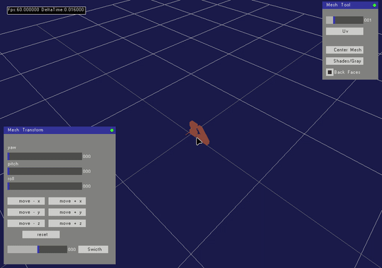
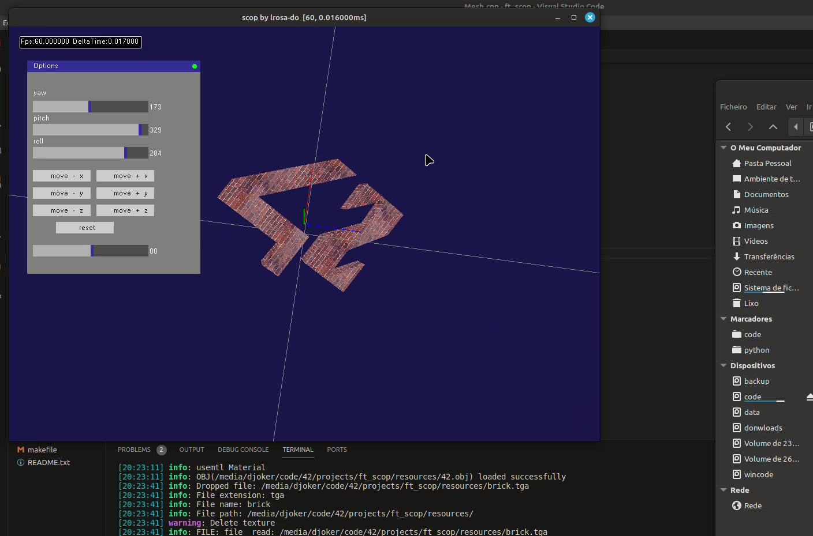
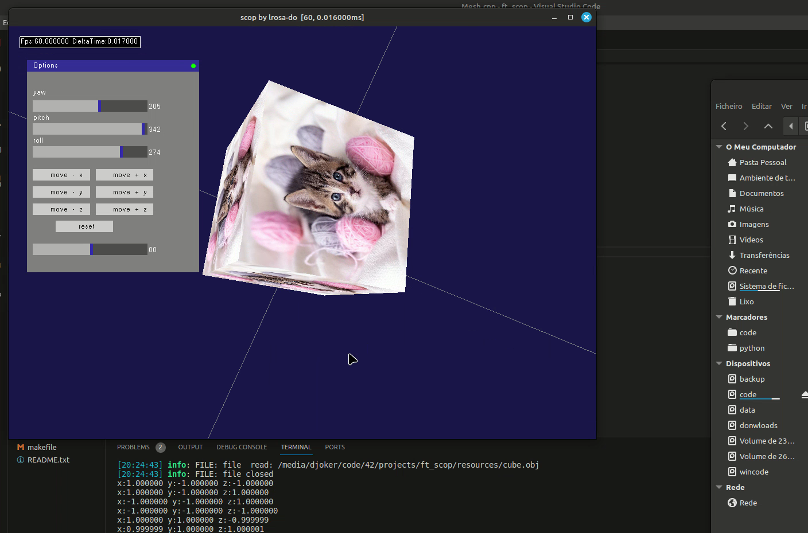
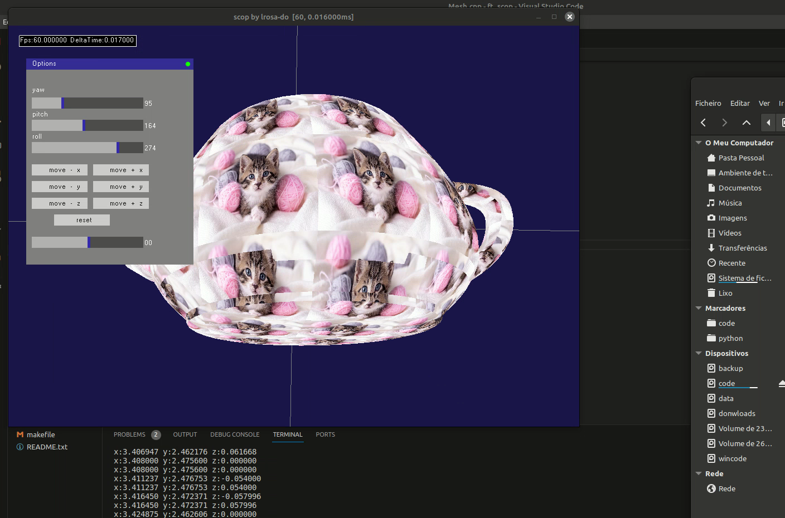
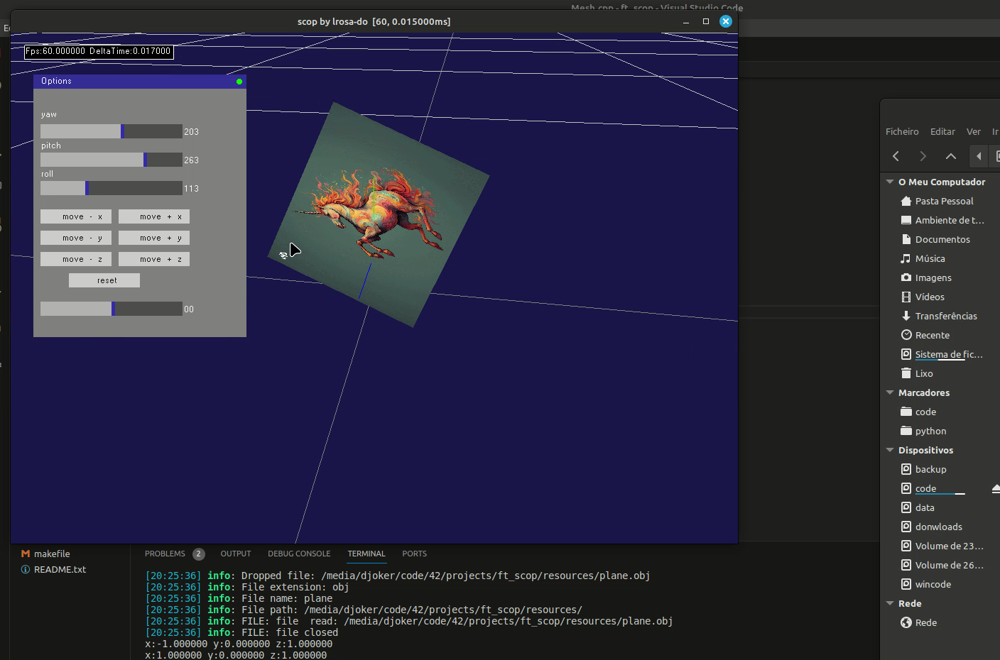

Subject
II.1
It does not hurt to feel good.

Once in a while, it feels good to feel good. So we are going to create a small app to feel great.

This project is also organized for you to use a bit of elbow grease. So we have a few restrictions in place.

What you need to do:
Your goal is to create a small program that will show a 3D object conceived with a modelization program like Blender. 
The 3D object is stored in a .obj file. You will be at least in charge of parsing to obtain the requested rendering.
In a window, your 3D object will be displayed in perspective (which means that what is far must be smaller), rotate on itself around its main symmetrical axis (middle of the object basically...). 
By using various colors, it must be possible to distinguish the various sides. 

The object can be moved on three axis, in both directions.
Finally, a texture must be applicable simply on the object when we press a dedicated key, and the same key allows us to go back to the different colors. 
A soft transition between the two is requested.

The technical constraints are as follows:
• You’re free to use any langages (C / C++ / Rust preferred )
• You’re free to choose between OpenGL, Vulkan, Metal and the MinilibX
• Have a classic Makefile (everything you usually put in there).
• You can use external libraries (other than OpenGL, Vulkan or Metal) ONLY to manage the windows and the events.
• No libraries are allowed to load the 3D object, nor to make your matrixes or to loadthe shaders.

As this is a program to auto-congratulate ourselves, it is crucial that you can present during defense at least the 42 logo given as resources, turning around its central axis (careful, not around one of its corners), with some shades of gray on the sides and a texture of poneys, kitten or unicorn your choice.

Bonus
Here are a few ideas of bonuses:
• The correct management of some ambiguous .obj files, concave, non coplanar... The teapot given with as resources exists in two versions: the first is the     original, with some strange border effects. The second is an import-export in Blender, with no  human touch, but normalized a little by the program. It’s about rendering correctly the first version.

• A more subtle application of the texture. It cannot be stretched on any of the sides
• There’s got to be more bonuses that you can implement.

# Some screenshots

